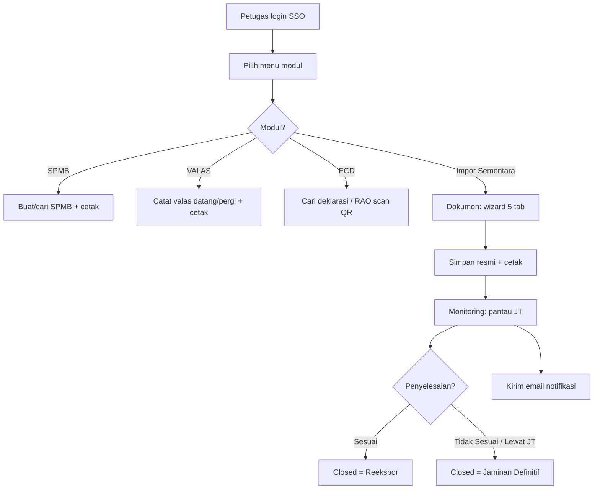
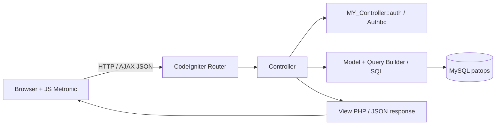
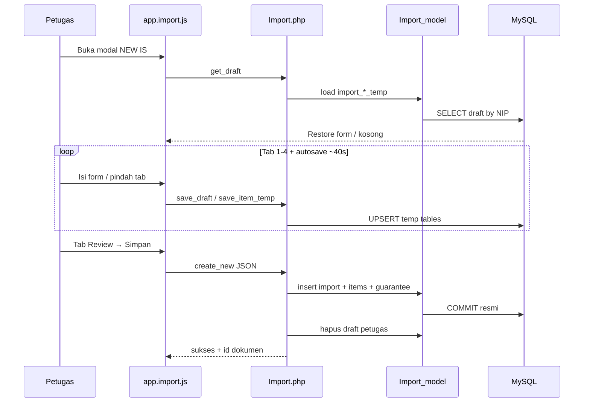
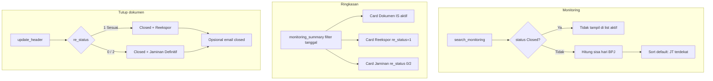
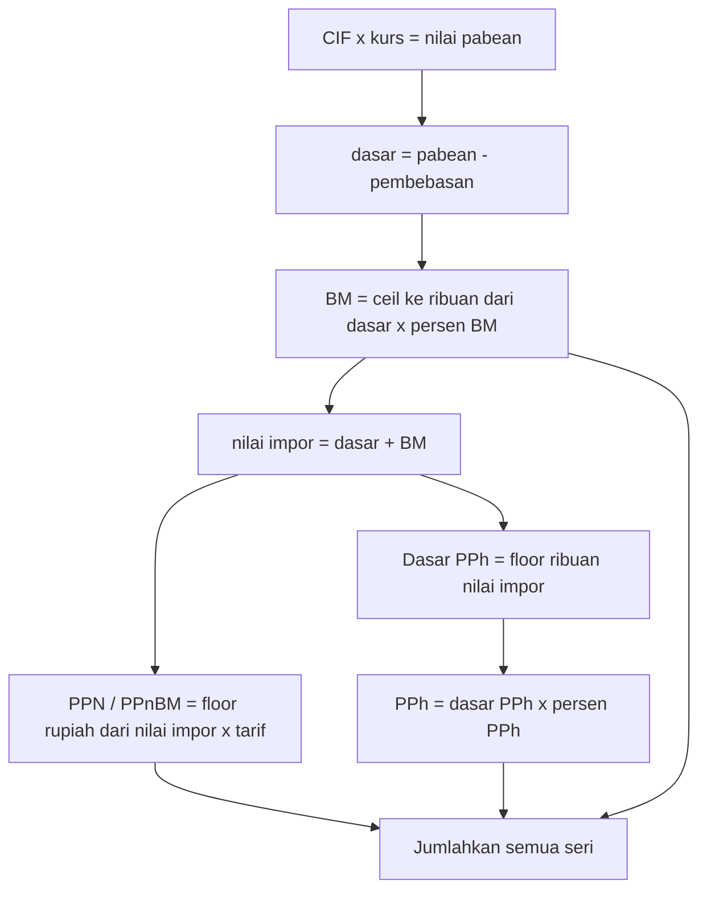
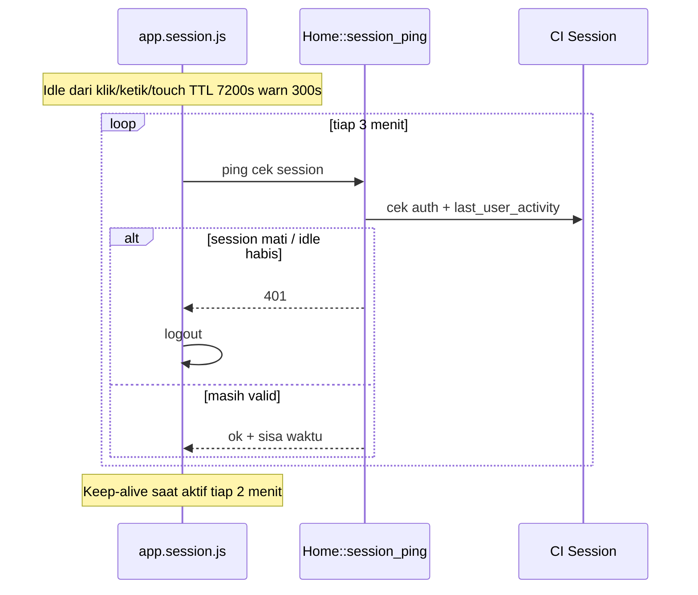
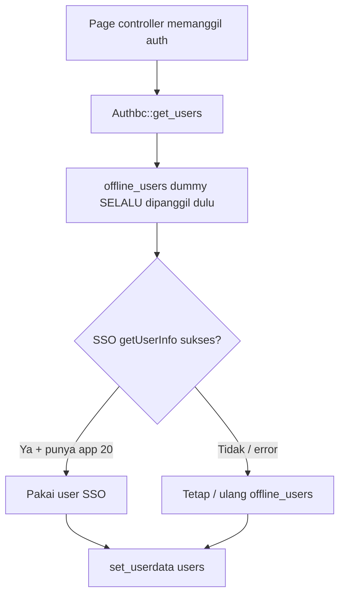
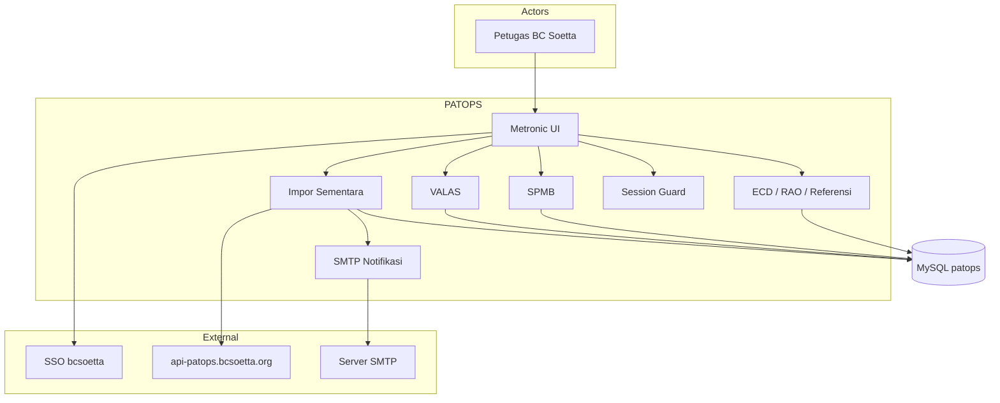

# Dokumentasi Aplikasi BC PATOPS

**Versi dokumen:** 2026-09-21  
**Aplikasi:** BC PATOPS (`ecdpatopsnew`)  
**Lingkungan tipikal:** CodeIgniter 3 / XAMPP / MySQL  
**Audiens:** Pejabat & non-IT · Developer · Security review  

Dokumen terkait:
- `README.md` — catatan perbaikan teknis modul **Impor Sementara**
- Canvas Cursor (buka di IDE):
  - [Dokumentasi lengkap](C:/Users/BCSOETTA/.cursor/projects/c-xampp-htdocs/canvases/patops-dokumentasi-lengkap.canvas.tsx)
  - [Security audit 20](C:/Users/BCSOETTA/.cursor/projects/c-xampp-htdocs/canvases/security-audit-20.canvas.tsx)

---

# BAGIAN A — Untuk non-IT / pejabat

## A.1 Apa itu PATOPS?

Aplikasi **internal** Bea Cukai Soekarno-Hatta untuk **petugas bandara**. Bukan untuk penumpang umum.

Fungsinya membantu petugas mencatat dan memantau urusan kepabeanan terkait penumpang: barang (SPMB), uang (VALAS), impor sementara, dan deklarasi elektronik (ECD).

## A.2 Siapa yang memakai?

| Peran | Keterangan |
|--------|------------|
| Petugas Bea Cukai Soetta | Login SSO; tampil nama, NIP, pangkat |
| Admin operasional (praktis) | Mengatur email notifikasi Impor Sementara |

## A.3 Menu utama

| Menu | Fungsi sederhana |
|------|------------------|
| Dashboard | Halaman awal setelah masuk |
| SPMB (BC 3.4) | Surat/izin barang penumpang |
| VALAS — Kedatangan | Catat uang yang dibawa **masuk** |
| VALAS — Keberangkatan | Catat uang yang dibawa **keluar** |
| Impor Sementara → Dokumen | Buat & kelola formulir barang sementara |
| Impor Sementara → Monitoring | Pantau jatuh tempo & penyelesaian |
| Impor Sementara → Setting | SMTP, template email, log kirim |
| ECD → Admin | Cari & lihat deklarasi elektronik |
| ECD → Tabel Referensi | Daftar barang atensi (perhatian khusus) |
| ECD → RAO | Scan QR lapangan, ubah jalur/zona |

## A.4 Cerita Impor Sementara (bahasa awam)

1. Petugas login  
2. Isi formulir **5 tahap**: Pemberitahu → Perjalanan & Sponsor → Barang → Jaminan → Review  
3. Simpan resmi & cetak  
4. Pantau sisa hari di **Monitoring**  
5. Tutup dokumen: **Reekspor** (sesuai) atau **Jaminan Definitif** (tidak sesuai / lewat JT)  
6. Bisa kirim email pengingat (lonceng)

**Draf:** isian tersimpan sementara selama masih login; logout menghapus draf.

### Status dokumen

| Status | Arti |
|--------|------|
| Created | Baru dibuat |
| Open | Sudah berjalan / diproses |
| Closed | Selesai ditutup |

### Hasil penyelesaian

| Hasil | Arti |
|--------|------|
| Sesuai | Reekspor OK |
| Tidak Sesuai | Bermasalah → jaminan |
| Lewat JT | Lewat batas waktu → jaminan |

## A.5 Perhitungan pungutan (awam)

Per jenis/seri barang:

1. Nilai pabean ≈ CIF × kurs  
2. **Bea Masuk** — biasanya 10%, dibulatkan **ke atas** ke ribuan  
3. **PPN** — dari (nilai pabean + BM), desimal **dibuang**  
4. **PPh** — dasar nilai impor dulu dibulatkan **ke bawah** ke ribuan, baru × tarif  

Contoh uji: CIF 100 USD, kurs 17.594, BM 10%, PPN 10%, PPh 7% → total **Rp 504.990**.

## A.6 Manfaat bisnis

- Data tidak tercecer di kertas  
- Jatuh tempo Impor Sementara lebih mudah dipantau  
- Perhitungan pungutan seragam  
- Jejak email & status penyelesaian  
- Beberapa layanan bandara dalam satu pintu  

## A.7 Pitch 30 detik

> PATOPS adalah sistem internal Bea Cukai Soetta untuk petugas bandara. Di dalamnya ada SPMB, valas datang/pergi, deklarasi elektronik, dan terutama Impor Sementara: buat dokumen, hitung pungutan, pantau jatuh tempo, kirim email, lalu tutup sebagai reekspor atau jaminan. Bukan aplikasi untuk penumpang umum.

## A.8 Bagan alur bisnis (non-IT)



---

# BAGIAN B — Untuk developer

## B.1 Stack & struktur

| Item | Detail |
|------|--------|
| Framework | CodeIgniter **3.1.6** + HMVC (`application/third_party/MX/`) |
| Runtime | PHP via XAMPP |
| DB | MySQL `patops`, driver `mysqli` |
| Auth | Library `authbc` → `MY_Controller::auth()` |
| UI | Metronic + jQuery + DataTables |
| Entry | `index.php` → default controller `spmb` |
| Route khusus | `valas-departure` → `Departure` |

### Layout folder penting

```
htdocs/
├── index.php
├── application/
│   ├── controllers/   Import, Valas, Departure, Spmb, Ecd, Rao, Reference, Home, Site, User
│   ├── models/        Import_model, …
│   ├── views/         impor/, ecd/, valas/, aside/
│   ├── core/          MY_Controller.php
│   ├── libraries/     Authbc.php
│   └── config/        routes, database, config
├── assets/js/         app.import.js, app.import.monitoring.js, app.session.js, …
├── README.md
└── DOKUMENTASI-APLIKASI.md   ← file ini
```

## B.2 Arsitektur request



**Pola modul IS:** page PHP render shell → JS memanggil endpoint `POST` JSON (`raw_input_stream`) → model → `json_encode`.

## B.3 Modul Impor Sementara — peta file

| Lapisan | File |
|---------|------|
| Controller | `application/controllers/Import.php` |
| Model | `application/models/Import_model.php` |
| Views | `application/views/impor/{index,monitoring,setting,setting_template,setting_log,print_*}.php` |
| JS | `assets/js/app.import.js`, `app.import.monitoring.js`, `app.import.setting.js` |
| Session | `assets/js/app.session.js`, `Home::session_ping`, `aside/script.php` |
| Menu | `application/views/aside/menu.php` |

### Tabel DB (IS)

**Dokumen:** `import`, `import_items`, `import_items_attachment`, `import_guarantee`, `import_sponsor`, `import_account`, `import_reexport_attachments`  
**Draf:** `import_header_temp`, `import_items_temp`, `import_items_attachment_temp`  
**Notif:** `import_smtp_setting`, `import_notif_format`, `import_notif_log`  
**Lookup:** `office`, `quantity_type`, …

> Schema notifikasi/draf: **manual DDL** (lihat `README.md`). App tidak auto-migrate.

## B.4 Endpoint penting (Import)

| Method / path | Fungsi |
|---------------|--------|
| `GET /import` | Halaman Dokumen |
| `POST /import/search` | List dokumen |
| `POST /import/create_new` | Simpan resmi |
| `POST /import/save_draft` / `get_draft` | Draf wizard |
| `POST /import/save_item_temp` | Barang sementara |
| `POST /import/upload_items` / `upload_import` | Upload lampiran |
| `POST /import/validate_email` | Validasi email + MX |
| `POST /import/update_header` | Ubah status / penyelesaian |
| `GET /import/print_form_is/{id}` dll. | Cetak |
| `GET /import/monitoring` | Halaman monitoring |
| `POST /import/search_monitoring` | Data tabel monitoring |
| `POST /import/monitoring_summary` | 3 card ringkasan |
| `POST /import/search_reekspor` / `search_jaminan_definitif` | Modal detail |
| `POST /import/preview_notification` / `send_notification` | Lonceng / bulk email |
| `POST /import/save_setting` / `test_notification` | SMTP & template |
| `POST /home/session_ping` | Idle session guard |

## B.5 Sequence — buat dokumen IS



## B.6 Flow — monitoring & penyelesaian



## B.7 Flow — pembulatan pungutan

Dihitung **per seri barang** di JS (`Import.calcPungutan`) dan PHP (`Import_model::calc_item_pungutan`):



| Pungutan | Aturan |
|----------|--------|
| Bea Masuk | `ceil` ke ribuan penuh |
| PPN / PPnBM | `(nilai pabean + BM) × tarif`, lalu `floor` ke rupiah |
| PPh | Dasar nilai impor `floor` ke ribuan dulu, baru × tarif |

## B.8 Flow — session idle



| Parameter produksi | Nilai |
|--------------------|-------|
| `sess_expiration` | 7200 detik (2 jam) |
| Peringatan | 300 detik sebelum habis |
| Ping cek | tiap 3 menit |
| Keep-alive saat aktif | tiap 2 menit |

Catatan: `auth()` tidak memperbarui `last_user_activity` di setiap AJAX.

## B.9 Flow — auth (kondisi aktual kode)



> Banyak endpoint API JSON Import/Valas/Departure **tidak** memanggil `auth()` — lihat Bagian C (security).

## B.10 Konstanta bisnis di kode

| Field | Nilai | Arti |
|-------|------:|------|
| `import.status` | 1 | Created |
| | 2 | Open |
| | 3 | Closed |
| `import.re_status` | 1 | Sesuai → Reekspor |
| | 0 | Tidak Sesuai → Jaminan |
| | 2 | Lewat JT → Jaminan |
| BPJ sisa hari | | `periode - (hari sejak doc_date)` |
| BM default UI | 10% | readonly |

## B.11 Modul lain (peta developer)

| Modul | Controller | JS tipikal |
|-------|------------|------------|
| SPMB | `Spmb.php` | view SPMB |
| Valas datang | `Valas.php` | `app.valas.js` |
| Valas pergi | `Departure.php` | `app.departure.js` |
| ECD | `Ecd.php` | `app.ecd.js` |
| Referensi | `Reference.php` | `app.ecd_reference.js` |
| RAO | `Rao.php` | `app.ecd_rao.js` |
| Home / Site / User | session, login shell, logout + hapus draf IS | |

## B.12 Konvensi pengembangan

1. Jangan auto-migrate schema dari PHP; DDL manual.  
2. Cache-bust JS: `?v=...` di view.  
3. SMTP: password kosong saat save = retain password lama.  
4. Setting SMTP vs template: partial save, jangan saling menimpa.  
5. Edit email di lonceng Monitoring tidak menulis ulang template Setting.  
6. Pembulatan pungutan harus sama di JS + PHP.  
7. Upload saat ini ke `assets/custom/` (webroot) — pertimbangkan path non-public saat hardening.

### Setup lokal tipikal

1. XAMPP Apache + MySQL, docroot `htdocs`  
2. Import DB `patops`  
3. Sesuaikan `application/config/database.php`  
4. Pastikan library `Authbc` tersedia  
5. Jalankan DDL tambahan IS dari `README.md` jika belum  

## B.13 Sistem keseluruhan



---

# BAGIAN C — Security audit (20 checks)

**Tanggal audit:** 2026-09-19 (read-only, tanpa ubah kode)  
**Ringkas:** 14 FAIL · 3 PARTIAL · 1 PASS · 1 N/A  

**Prioritas kritis**
1. Auth selalu fallback ke user offline — tidak fail-closed  
2. Banyak API JSON/upload tanpa `auth()`  
3. Default `ENVIRONMENT=development` + `db_debug=TRUE`  
4. Secret hardcoded / ter-track di git  
5. Session: `cookie_httponly` & `cookie_secure` = FALSE; CSRF off  

## C.1 Scorecard

| # | Check | Hasil | Bukti singkat |
|---|--------|-------|---------------|
| 1 | API key aman | **FAIL** | API key di JS publik; SSO secret hardcoded di `Authbc.php` |
| 2 | env jangan public | **FAIL** | Tidak ada `.env`; config di webroot; `.gitignore` tidak cover `.env` |
| 3 | no hardcode secret | **FAIL** | `encryption_key`, DB root kosong, SSO `asdqwe`, offline dummy |
| 4 | cek secret di git | **FAIL** | `database.php` & `config.php` ter-track berisi kredensial/key |
| 5 | debug mode off | **FAIL** | `index.php` default `development`; `display_errors=1`; `db_debug=TRUE` |
| 6 | error jangan bocor | **FAIL** | Error PHP/DB ke browser; upload mengembalikan `display_errors()` |
| 7 | validasi input | **PARTIAL** | Email MX ok; `form_validation` jarang; JSON raw langsung diproses |
| 8 | sanitasi input | **PARTIAL** | `global_xss_filtering` tidak cover JSON body |
| 9 | anti SQL injection | **FAIL** | `Setting_model::get_Auth` string concat username/password |
| 10 | anti XSS | **FAIL** | Views echo data tanpa `html_escape` |
| 11 | server side auth | **FAIL** | `Authbc` offline fallback; banyak endpoint tanpa `auth()` |
| 12 | cek akses user | **FAIL** | Search semua baris; `get_detail` tanpa ownership; `my_decrypt` lemah |
| 13 | role admin aman | **FAIL** | Tidak ada RBAC server-side; Setting terbuka |
| 14 | db jangan public | **PASS** | `hostname = localhost` |
| 15 | db permission ketat | **FAIL** | User `root`, password kosong |
| 16 | Hash Password | **FAIL** | Tidak ada `password_hash`; bandingkan plain di SQL legacy |
| 17 | session aman | **FAIL** | `cookie_secure=FALSE`, `cookie_httponly=FALSE`, `csrf_protection=FALSE` |
| 18 | reset password aman | **N/A** | UI theme-only; tidak ada API reset token |
| 19 | batasi file upload | **PARTIAL** | jpg/png + max_size di sebagian modul; Spmb max_size dikomentari |
| 20 | scan file upload | **FAIL** | Tidak ada scan konten; simpan di `assets/custom/` (webroot) |

## C.2 Cuplikan bukti kritis

**Auth offline fallback** — `application/libraries/Authbc.php` (`get_users` selalu memanggil `offline_users`).

**API tanpa auth** — contoh `Import::search()` langsung decode JSON tanpa `auth()`.

**Debug** — `index.php`: default `ENVIRONMENT = development`.

**DB** — `application/config/database.php`: `root` / password kosong / `db_debug = TRUE`.

**Session** — `application/config/config.php`: `cookie_secure`, `cookie_httponly` false; `csrf_protection` false.

## C.3 Urutan perbaikan disarankan

1. Matikan offline fallback di production; wajib SSO; deny jika gagal  
2. Wajibkan `auth()` (atau filter) di semua API + cek ownership  
3. Set `CI_ENV=production`; matikan `display_errors` & `db_debug`  
4. Pindahkan secret ke env di luar git; user DB bukan root  
5. Query binding saja; escape output; HttpOnly + Secure + CSRF; upload di luar webroot + validasi MIME ketat  

---

# BAGIAN D — Referensi cepat

| Topik | Lokasi |
|--------|--------|
| Perbaikan IS (changelog teknis) | `README.md` |
| Dokumentasi lengkap (file ini) | `DOKUMENTASI-APLIKASI.md` |
| Pembulatan pungutan | `assets/js/app.import.js` → `calcPungutan`; `Import_model::calc_item_pungutan` |
| Session guard | `assets/js/app.session.js` |
| Menu | `application/views/aside/menu.php` |
| Repo | GitHub `bcsoetta/ecdpatopsnew` |

---

*Dokumen ini digabung dari sesi analisis aplikasi, dokumentasi non-IT/developer, bagan alur, dan security audit 20 poin. Tidak menggantikan prosedur resmi Bea Cukai.*
